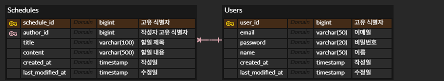
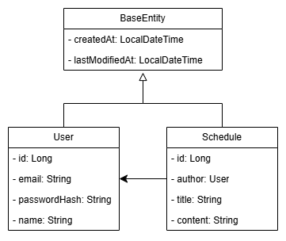

# ERD 및 DDL



```sql
DROP TABLE IF EXISTS Schedules;
DROP TABLE IF EXISTS Users;

CREATE TABLE `Users`
(
    `user_id`         bigint AUTO_INCREMENT COMMENT '고유 식별자',
    `email`           varchar(50) NOT NULL UNIQUE COMMENT '이메일',
    `password`        varchar(20) NOT NULL COMMENT '비밀번호',
    `name`            varchar(50) NOT NULL COMMENT '이름',
    `created_at`      timestamp   NOT NULL COMMENT '작성일',
    `last_updated_at` timestamp   NOT NULL COMMENT '수정일'
);

CREATE TABLE `Schedules`
(
    `schedule_id`      bigint AUTO_INCREMENT COMMENT '고유 식별자',
    `author_id`        bigint       NOT NULL COMMENT '작성자 고유 식별자',
    `title`            varchar(30)  NOT NULL COMMENT '할일 제목',
    `content`          varchar(500) NOT NULL COMMENT '할일 내용',
    `created_at`       timestamp    NOT NULL COMMENT '작성일',
    `last_modified_at` timestamp    NOT NULL COMMENT '수정일'
);

ALTER TABLE `Users`
    ADD CONSTRAINT `PK_USERS` PRIMARY KEY (`user_id`);

ALTER TABLE `Schedules`
    ADD CONSTRAINT `PK_SCHEDULES` PRIMARY KEY (`schedule_id`);
```

# 엔티티 다이어그램

]

# API 요약

오류 포함 응답 객체는 하단 참조

## 인증 없이 접근 가능한 엔드포인트

| 기능   | Method | url           | 요청                                                                                                                             | 응답                  |
|------|--------|---------------|--------------------------------------------------------------------------------------------------------------------------------|---------------------|
| 로그인  | POST   | /login        | 요청 body<br>- email(string): 가입한 이메일, 필수<br>- password(string): 사용자 비밀번호, 필수, 1-20글자<br>                                        | 204                 |
| 로그아웃 | POST   | /logout       | .                                                                                                                              | 204                 |
| 회원가입 | POST   | /users/signup | 요청 body<br>- email(string): 가입할 이메일, 필수<br>- password(string): 사용자 비밀번호, 필수, 1-20글자<br>- name(string): 사용자 이름, 필수, 2-50 글자<br> | 201, `UserResponse` |

## 인증이 필요한 엔드포인트

### 사용자 관련 API

| 기능              | Method | url       | 요청                                                                                                                                           | 응답                        |
|-----------------|--------|-----------|----------------------------------------------------------------------------------------------------------------------------------------------|---------------------------|
| 유저 목록 페이지 조회    | GET    | /users    | 요청 파라미터<br>- page(integer): 조회할 페이지, 0부터 시작, 기본값 0<br>- size(integer): 한 페이지에 있는 사용자 정보 개수, 기본 10<br>- sort(string): 정렬 기준, 기본 createdAt<br> | 200, `Page<UserResponse>` |
| 자신의 정보 조회       | GET    | /users/me | .                                                                                                                                            | 200, `UserResponse`       |
| 자신의 정보(비밀번호) 수정 | PATCH  | /users/me | 요청 body<br>- currentPassword(string): 현재 비밀번호, 필수<br>- newPassword: 새 비밀번호, 필수, 1-20자<br>                                                    | 200, `UserResponse`       |
| 자신의 정보 삭제(탈퇴)   | DELETE | /users/me | 요청 body<br>- currentPassword(string): 현재 비밀번호, 필수<br>                                                                                        | 204                       |

### 할일 관련 API

| 기능        | Method | url             | 요청                                                                                                                                                   | 응답                                   |
|-----------|--------|-----------------|------------------------------------------------------------------------------------------------------------------------------------------------------|--------------------------------------|
| 할일 등록     | POST   | /schedules      | 요청 body<br>- title(string): 할일 제목, 필수, 1-30자<br>- content(string): 내용, 필수, 500자 이내, 공백 가능<br>                                                        | 201, location 헤더, `ScheduleResponse` |
| 할일 페이지 조회 | GET    | /schedules      | 요청 파라미터<br>- page(integer): 조회할 페이지, 0부터 시작, 기본값 0<br>- size(integer): 한 페이지에 있는 사용자 정보 개수, 기본 10<br>- sort(string): 정렬 기준, 기본 <br>lastUpdatedAt<br> | 200, `Page<ScheduleResponse>`        |
| 할일 단건 조회  | GET    | /schedules/{id} | 경로<br>- id(integer): 할일 식별자<br>                                                                                                                      | 200, `ScheduleResponse`              |
| 할일 수정     | PATCH  | /schedules/{id} | 경로<br>- id(integer): 할일 식별자<br>요청 body<br>- title(string): 수정할 제목, 1-30자<br>- content(string): 수정할 내용, 500자 이내<br>                                   | 200, `ScheduleResponse`              |
| 할일 삭제     | DELETE | /schedules/{id} | 경로<br>- id(integer): 할일 식별자<br>                                                                                                                      | 204                                  | 

## 응답 예시

### 정상 응답

1. `UserResponse`
    ```json
    {
        "id": 3,
        "email": "email@email.com",
        "name": "name",
        "createdAt": "2025-05-26T12:10:07.0811361",
        "lastUpdatedAt": "2025-05-26T12:10:07.0811361"
    }
    ```
2. `ScheduleResponse`
    ```json
    {
        "id": 2,
        "author": "name",
        "title": "new schedule",
        "content": "do something",
        "createdAt": "2025-05-26T12:13:39.9403682",
        "lastUpdatedAt": "2025-05-26T12:13:39.9403682"
    }
    ```

3. `Page<UserResponse>`
    ```json
    {
        "content": [
            {
                "id": 3,
                "email": "email@email.com",
                "name": "name",
                "createdAt": "2025-05-26T12:10:07.081136",
                "lastUpdatedAt": "2025-05-26T12:10:07.081136"
            },
            {
                "id": 2,
                "email": "god@heaven.world",
                "name": "god",
                "createdAt": "2025-05-24T00:31:52.56042",
                "lastUpdatedAt": "2025-05-24T00:31:52.56042"
            },
            {
                "id": 1,
                "email": "user@email.com",
                "name": "another_user",
                "createdAt": "2025-05-24T00:31:51.883331",
                "lastUpdatedAt": "2025-05-24T00:31:51.883331"
            }
        ],
        "pageable": {
            "pageNumber": 0,
            "pageSize": 10,
            "sort": {
                "empty": false,
                "sorted": true,
                "unsorted": false
            },
            "offset": 0,
            "paged": true,
            "unpaged": false
        },
        "last": true,
        "totalPages": 1,
        "totalElements": 3,
        "first": true,
        "numberOfElements": 3,
        "size": 10,
        "number": 0,
        "sort": {
            "empty": false,
            "sorted": true,
            "unsorted": false
        },
        "empty": false
    }
    ```

### 오류 응답

필드를 입력하지 않고 `/login`에 요청을 보낸 경우

```json
{
  "title": "Bad Request",
  "detail": "입력값을 다시 확인하세요",
  "status": 400,
  "instance": "/login",
  "errors": [
    {
      "field": "email",
      "reason": "이메일을 입력하세요."
    },
    {
      "field": "password",
      "reason": "비밀번호를 입력하세요."
    }
  ]
}
```

위와 같은 응답이 반환된다. 다른 모든 경우에도 응답 형식은 동일하다.

- title: HTTP 상태코드에 해당하는 메시지
- detail: 오류 상세 메시지
- status: HTTP 상태코드
- instance: 요청 url
- errors: 입력값 검증 실패 시 관련 정보
    - field: 검증 실패한 JSON 필드명
    - reason: 검증 실패 이유