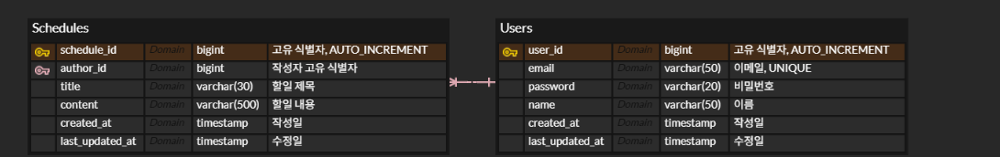

# ERD 및 DDL


```sql
CREATE TABLE `Users`
(
    `user_id`          bigint AUTO_INCREMENT COMMENT '고유 식별자',
    `email`            varchar(50) NOT NULL COMMENT '이메일',
    `password`         varchar(20) NOT NULL COMMENT '비밀번호',
    `name`             varchar(50) NOT NULL COMMENT '이름',
    `created_at`       timestamp   NOT NULL COMMENT '작성일',
    `last_modified_at` timestamp   NOT NULL COMMENT '수정일'
);

CREATE TABLE `Schedules`
(
    `schedule_id`      bigint AUTO_INCREMENT COMMENT '고유 식별자',
    `author_id`        bigint       NOT NULL COMMENT '작성자 고유 식별자',
    `title`            varchar(100) NOT NULL COMMENT '할일 제목',
    `content`          varchar(500) NOT NULL COMMENT '할일 내용',
    `created_at`       timestamp    NOT NULL COMMENT '작성일',
    `last_modified_at` timestamp    NOT NULL COMMENT '수정일'
);
```
# 엔티티 다이어그램
]

# API 요약
